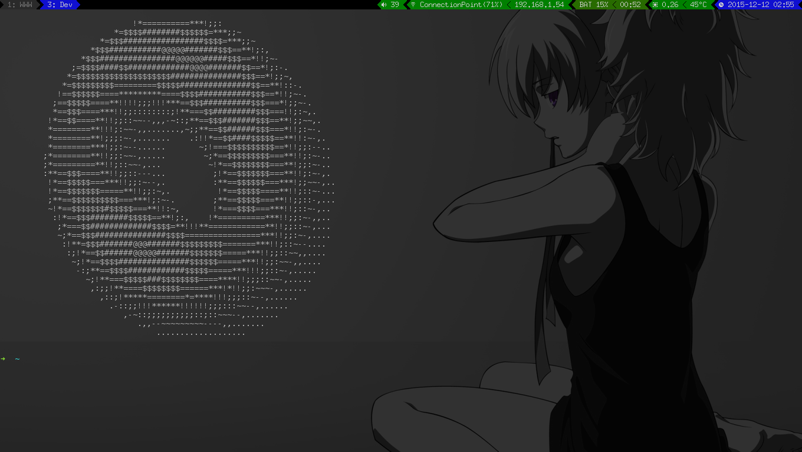

# **Statorange**

|Build status|
|:--:|
|Unstable|



This is a status generator for i3 designed to replace i3bar/i3status.

## Prerequisites

Obviously, this software does NOT run on windows.
Statorange is tightly bound to the really awesome window manager i3,
so we have that. Also bar (lemonbar) is required for the actual panel.

The predefined status items use the following programs/files:

* Battery<br>
  * The [missing] file `/sys/class/power_supply/BAT0/uevent` and the ability to read files.

* Volume<br>
  * `alsamixer`, which opens when you click the volume section.

* Space<br>
  * `df -h` which _should_ be available from the get-go.

* Network<br>
  * `/sbin/iwconfig` to get info about the wireless connection.

* CPU<br>
  * temperature: `/sys/bus/acpi/devices/LNXTHERM:00/thermal_zone/temp`
  * load: `/proc/loadavg`
  * `htop` pops up when this section is clicked.

Also, since lemonbar does not provide a trayer section something like trayer
is advisable. You can add a shortcut to toggle_trayer.sh (i chose mod+t)
to toggle trayer, for when you really need it (you won't use them a lot,
except for nm-applet or wicd to connect to a network GRAPHICALLY).

### Required Packaged Software
* `i3-wm`
* `g++`
* `make`
* `alsa-utils`
* `trayer`
* `htop`
* `x-terminal-emulator` (e.g. `terminator`)

### Found on GitHub
* <a href=https://github.com/LemonBoy/bar>`bar` (`lemonbar`)</a> : https://github.com/LemonBoy/bar.git

## Compiling

Basically it's just typing `make` into the console. This compiles
the status generator (the part which produces a formatted string which
is fed to lemonbar).

## Installing fonts

The fonts used in statorange_launcher.sh have to be regustered. Copy the fonts from res to ~/.fonts.
Also these commands must be run on sartup (put them in ~/.xsession):

```shell
xset fp+ $HOME/.fonts/misc
xset fp+ $HOME/.fonts/ohsnap
xset fp+ $HOME/.fonts/terminesspowerline
xset fp+ $HOME/.fonts/tewi
```

## Launching

Probably you want to replace i3bar/i3status with statorange/lemonbar.
Remove or comment out the bar section in your i3 config (~/.i3/config or ~/.config/i3/config):
```shell
#bar {
#        status_command i3status
#}
```
Instead place these two lines at the end of the config:
```shell
# TRAYER
bindsym $mod+t exec PATHTOSTATORANGE/toggle_trayer.sh
# STATORANGE
exec PATHTOSTATORANGE/statorange_launcher.sh > PATHTOSTATORANGE/statorange_launcher.log
```
(Don't forget to replace _PATHTOSTATORANGE_)

## Config

The config (`config.json`) is written in JSON. An example configuration can be found in `config.example.json`.

* `get_socket` - retrieve i3 un*x socket path.
* `cooldown` - delay between bar updates in seconds.
* static settings for the state items (CPU, Battery, Volume, Space, Date, Net).
Check if the `/sbin/iwconfig` executable is present.
* `order` - as the name implies, the order is important.
The objects in this list specify the sections on the right side of the bar.
Each object has the following fields:
  * `item` - the name of the item (CPU, Battery, ...)
  * `cooldown` - the delay between state updates.
  * [optional] `button` the command to execute when the section is pressed.

Also some objects require additional fields:
* Net
  * `type` - ethernet or wireless
  * `interface` - the interface. Available interfaces can be displayed by running `/sbin/ifconfig`.
  * `show` - what address to show (ipv4, ipv6, none, both, ipv6_fallback)
* Space
  * `mount_points` - an array of mount points. I have /home as a separate partition.
Available mount points can be queried with `df -h`.
* Volume
  * `card` - the soundcard (put default there)
  * `mixer` - probably you want to put "Master" there
* Date
  * `format` - <a href=http://www.cplusplus.com/reference/iomanip/put_time/>the format in which to print the date.</a>

After configuring the configuration perform a relogin.

## Logs

The logs are saved in these files:
```shell
lemonbar.log #from lemonbar
statorange.log #err stream from statorange
statorange_launcher.log #err stream from statorange_launcher.sh
```

## Inner structure

Statorange splits into two threads. The main one sleeps most of the time.
Every 5 seconds (default... probably) it wakes up, queries the WM state,
updates the system state if necessary (you can set the update interval for each item),
and prints a lemonbar formatted string to stdout before going back to sleep.

Lemonbar updates every time a newline is read.

The second thread, the event listener, opens a second UNIX socket to the WM
and registers for some events (which affect the status bar, like workspace events).
When an event is received, the event listener processes it and
notifies the main thread, which printfs the formatted string.

Also you can send SIGUSR1, which makes statorange force an update
(useful when adjusting the volume via command/button shortcuts).

In Lemonbar you can define button sections. When a button is pressed
a string is printed to stdout (coincidentally this string is a shell command)
which can and will be redirected to a shell.

To define other state items (like a VLC section which displays the currently playing song)
take a look at the existing items in `src/StateItems/`. The items are instantiated in
`src/SrareItem.cpp:init()`. Include your .hpp, set the static settings, and add an if
to the loop below. Put the settings into the config.

## Author

Alexander Dmitriev

Feel free to contact me about bugs or suggestions :)
